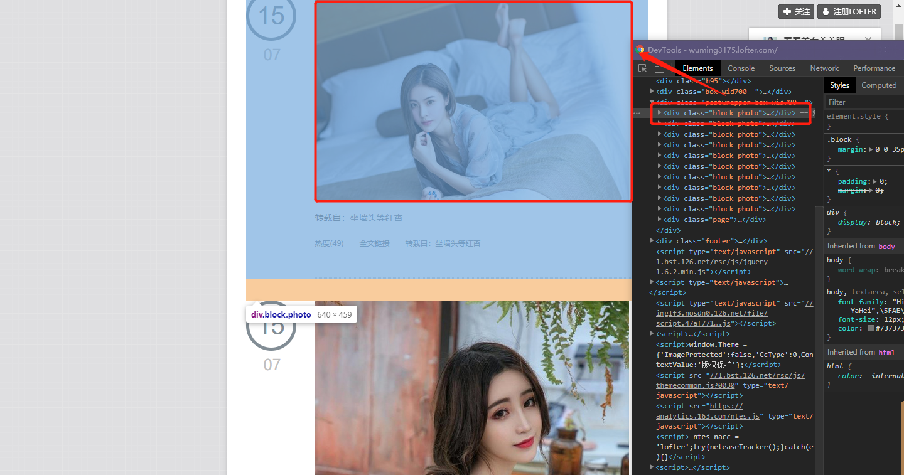
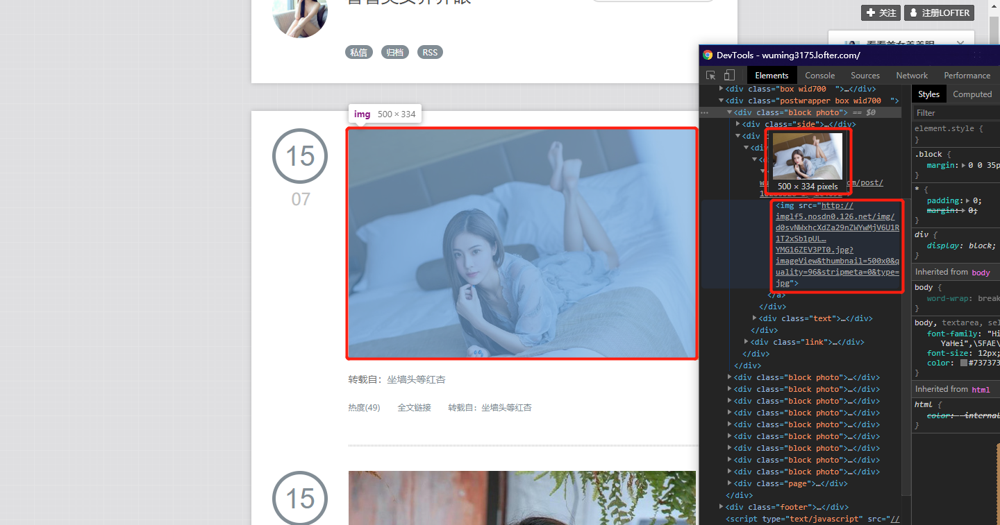

1. 访问网址：http://wuming3175.lofter.com/

2. 分析

2.1、Elements 分析

一个 class 为 block photo 的 div 就对应一个图片盒子。

而它的子元素中有一个 img 标签，其中的 src 属性值就是图片的 URL。

将 src 对应的 URL 在一个新的窗口打开，即可看到对应的图片。

URL：http://imglf5.nosdn0.126.net/img/d0svNWxhcXdZa29nZWYwMjV6U1R1T2xSb1pUL1ErREVDNlo2NWQxdHB6R1ZTUmNYMG16ZEV3PT0.jpg?imageView&thumbnail=500x0&quality=96&stripmeta=0&type=jpg

将 URL 简化之后也可得到相同的图片：

URL：http://imglf5.nosdn0.126.net/img/d0svNWxhcXdZa29nZWYwMjV6U1R1T2xSb1pUL1ErREVDNlo2NWQxdHB6R1ZTUmNYMG16ZEV3PT0.jpg

2.2、Page分析

第一页URL：http://wuming3175.lofter.com/

第二页URL：http://wuming3175.lofter.com/?page=2&t=1530867959322

第三页URL：http://wuming3175.lofter.com/?page=3&t=1484930020055

第四页URL：http://wuming3175.lofter.com/?page=4&t=1481210065143

……

第 n 页URL：http://wuming3175.lofter.com/?page=(n)&t=(t)

经过简单的分析可以得出，page=n 是页码，最多只有22页，而 t=(t) 是时间戳，实践证明，只有 page 而没有 t 也可成功访问。

3. 思路

首先使用 for 循环遍历第 1 页到第 22 页，将页码与 URL 进行拼接；

然后爬取每个页面的所有元素，并使用正则表达式过滤 img 的 src 属性同时简化其 URL；

最后通过 URL 获取图片二进制数据并保存到本地。
