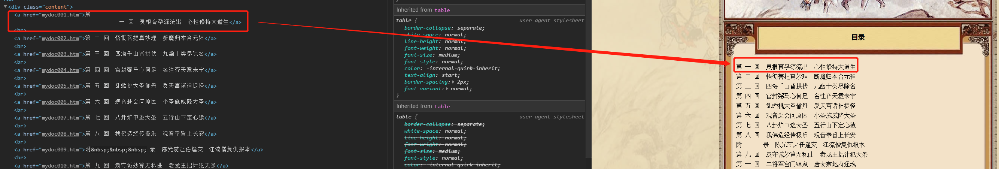
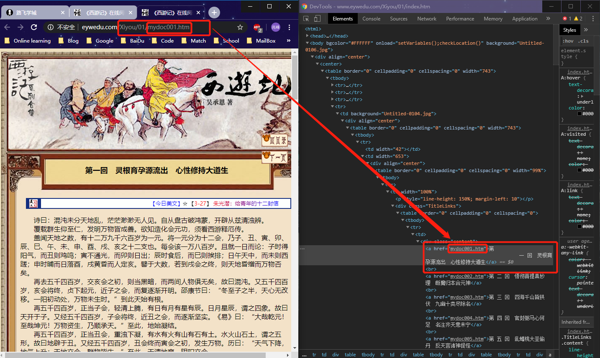

## 1. 确定网址

http://www.eywedu.com/Xiyou/01/index.htm

## 2. 分析

#### 2.1、Elements分析

content 下 a 标签的包含的内容就是每一回的标题：

所以先获取 HTML 的所有内容，然后使用 select(".content > a") 提取所有的标题，顺便提取 href 属性作为爬取后续每一回内容的部分 URL。

对于每一回的文章内容，为属性 width="100%" 的 td 下直系文本内容：

#### 2.2、Page分析

第一回对应的URL：http://www.eywedu.com/Xiyou/01/mydoc001.htm，与 a 标签的 href 属性正好吻合：

